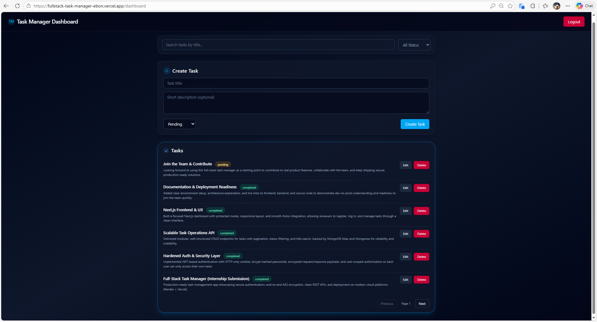
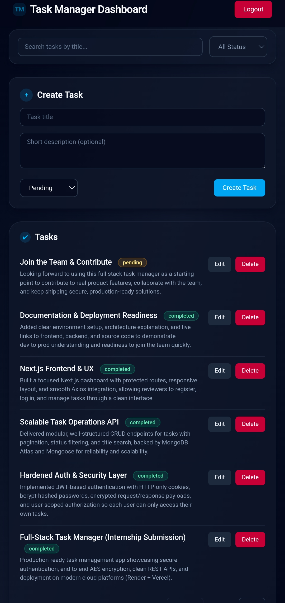

---

> # Full Stack Task Manager
> Secure **Task Management Application** built with **Next.js**, **Node.js**, **Express**, and **MongoDB**.
> The project demonstrates **JWT authentication, encrypted APIs, secure cookies, and full CRUD task management** with a modern frontend dashboard.

---

> # Live Demo
> Frontend (Deployed on Vercel): **[https://fullstack-task-manager-ebon.vercel.app](https://fullstack-task-manager-ebon.vercel.app)**

# Demo Credentials
You can test the application using the following account:

```
Email: ankit1@test.com
Password: 12345678
```

### Desktop View


### Mobile View

---

# Project Architecture

```
Frontend (Next.js)
      │
      │ Encrypted API Requests
      ▼
Backend (Node.js + Express)
      │
      │ JWT Authentication + AES Encryption
      ▼
MongoDB Database
```

---

# Features

### Authentication

* User registration
* Secure login system
* Password hashing using **bcrypt**
* JWT authentication stored in **HTTP-only cookies**

### Task Management

* Create tasks
* View tasks
* Update tasks
* Delete tasks
* Search tasks by title
* Filter tasks by status
* Pagination support

### Security

* AES encrypted request and response payloads
* Protected routes with JWT middleware
* CORS configuration
* Secure cookie handling

---

## Tech Stack

### Frontend


### Backend


---

# Repository Structure

```
fullstack-task-manager/
│
├── backend/
│   ├── config/
│   ├── controllers/
│   ├── middleware/
│   ├── models/
│   ├── routes/
│   ├── utils/
│   └── server.js
│
├── frontend/
│   ├── app/
│   │   ├── login/
│   │   ├── register/
│   │   └── dashboard/
│   ├── services/
│   └── utils/
│
└── README.md
```

---

# Installation (Local Setup)

Clone the repository:

```
git clone https://github.com/AnkitDimri4/fullstack-task-manager.git
```

## Backend Setup

> - **[Backend README](https://github.com/AnkitDimri4/fullstack-task-manager/blob/main/backend/README.md)**
```
cd backend
npm install
npm run dev
```

Create `.env`:

```
PORT=5000
MONGOURI=your_mongodb_uri
JWT_SECRET=your_jwt_secret
AES_SECRET=your_aes_secret
CLIENT_ORIGIN=http://localhost:3000
```

---

## Frontend Setup


> - **[Frontend README](https://github.com/AnkitDimri4/fullstack-task-manager/blob/main/frontend/README.md)**
```
cd frontend
npm install
npm run dev
```

Create `.env.local`:

```
NEXT_PUBLIC_API_URL=http://localhost:5000/api
NEXT_PUBLIC_AES_SECRET=your_aes_secret
```

Open:

```
http://localhost:3000
```

---

# Authentication Flow

1. User registers via `/register`
2. Payload is encrypted using AES
3. Backend decrypts the request
4. Password is hashed with bcrypt
5. On login, JWT is issued and stored in HTTP-only cookies
6. Protected routes verify JWT before allowing access

---

# Deployment

### Frontend

Deployed using **Vercel**

### Backend

Recommended deployment using **Render**

---

## Author

**Ankit Dimri**  
Full-Stack & AI Developer – Dehradun, India  

[](https://github.com/AnkitDimri4)
[](https://linkedin.com/in/ankit-dimri-a6ab98263)
[](https://leetcode.com/u/user4612MW/)


---

## Project Info

- **Project:** Full Stack Task Manager  
- **Role:** Full Stack Development Intern  
- **Organization:** Myraid  
- **Stack:** Next.js (Frontend) · Node.js/Express (Backend) · MongoDB  
- **Key Requirements:** JWT auth, AES-encrypted request/response, pagination, search, filters  
- **Year:** 2026  

---

<div align="center">
Built and designed by <strong>Ankit Dimri</strong>    © 2026
</div>

---
